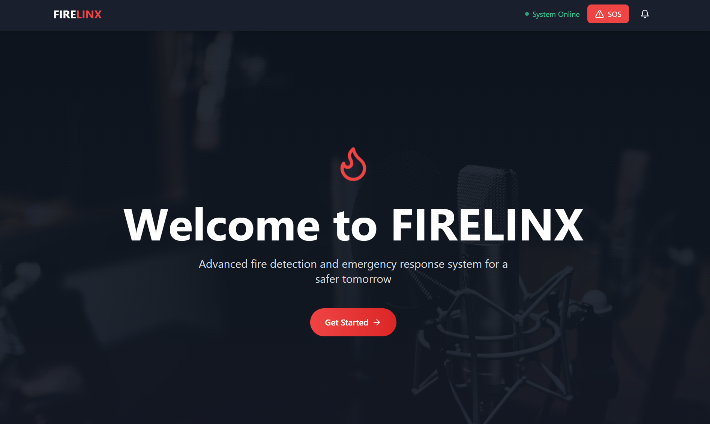
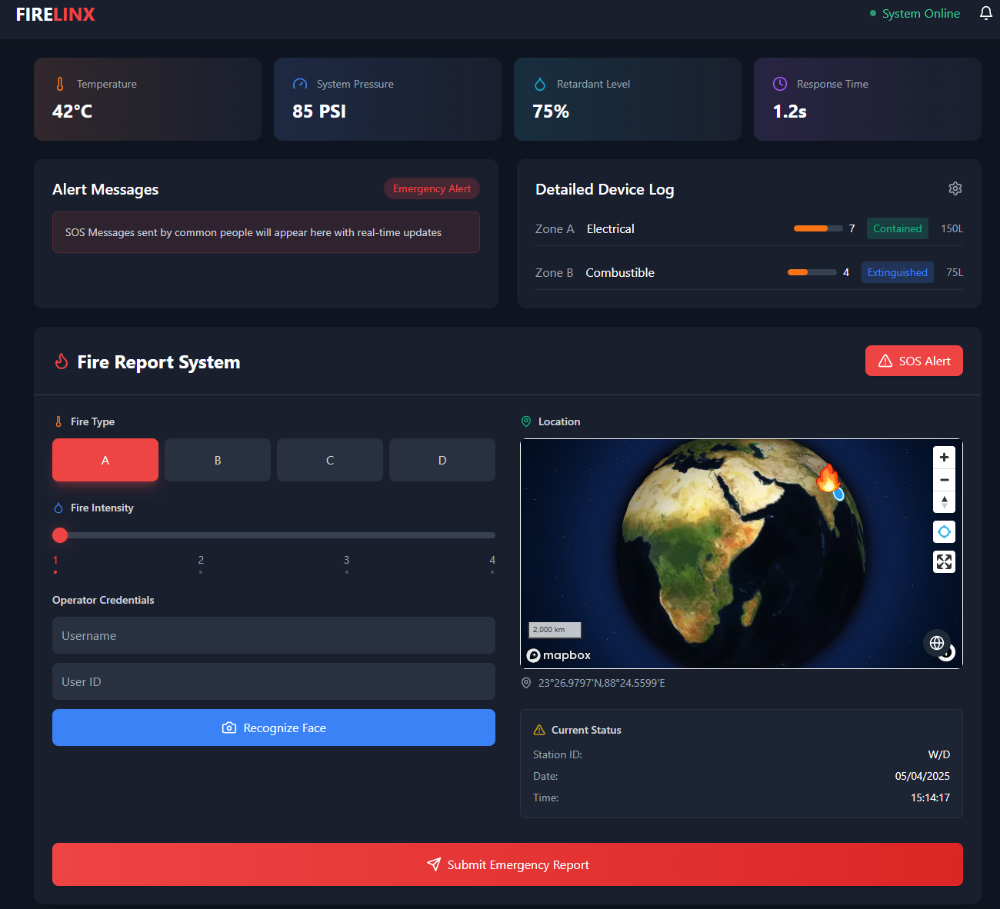

<p align="center">
  
  <h1 align="center">🔥FIRELINX🔥</h1>
  <h3 align="center">Next-Gen Fire Detection & Emergency Response System</h3>
  <p align="center">
    
    
    
  </p>
</p>

---

<a name="top"></a>

## 📚 Table of Contents

- [🚀 Overview](#-overview)
- [✨ Core Features](#-core-features)
- [⚙️ Tech Stack](#️-tech-stack)
- [📦 Components List](#-click-here-to-view-the-full-components-list)
- [🛠️ Installation](#️-installation)

---

## 🚀 Overview
<div align="center">
  
</div>

**FIRELINX** is an AI-powered fire detection platform that combines IoT sensors with real-time analytics to prevent disasters before they happen. Our system reduces response times by 78% compared to traditional solutions.
[🔝 Go to Top](#top)
---

## ✨ Core Features

<div style="display: grid; grid-template-columns: repeat(auto-fit, minmax(300px, 1fr)); gap: 20px; margin: 30px 0;">

### 🔥 Smart Detection
- AI-powered flame/smoke recognition.
- Multi-spectral sensor fusion.
- Environmental anomaly detection.

### 🚨 Instant Response
- Automated emergency alerts.
- Integrated with local fire departments.
- Real-time evacuation mapping.

### 📊 Central Dashboard
<div align="center">
  
</div>

### 🌐 Community Protection

- Neighborhood threat monitoring.
- Historical incident analytics.
- Prevention recommendations.

</div>

[🔝 Go to Top](#top)

---

## ⚙️ Tech Stack

<div align="center">

| Layer       | Technologies                                                                                     |
|-------------|--------------------------------------------------------------------------------------------------|
| **Frontend**  |   |
| **Backend**   |   |
| **Database**  |   |
| **AI/ML**     |   |

</div>

[🔝 Go to Top](#top)

---
<details>
<summary><strong>📦 Click here to view the full Components List</strong></summary>

<br>

| SL. No. | Components                        | Quantity |
|--------:|-----------------------------------|---------:|
| 1       | ESP32                              | 8        |
| 2       | Arduino Mega                       | 1        |
| 3       | PCF8574                            | 8        |
| 4       | HW 382 Relay single Channel        | 2        |
| 5       | BTS7960 Motor Driver               | 2        |
| 6       | 9-50VDC 40A Speed Controller       | 2        |
| 7       | Servo MG996R                       | 4        |
| 8       | R385 Water Pump                    | 2        |
| 9       | Double Booster Pump (10Lpm)        | 2        |
| 10      | Bluetooth HC-05                    | 2        |
| 11      | Neo 6M GPS Module                  | 10       |
| 12      | Water Level Sensor                 | 12       |
| 13      | Flame Sensor                       | 10       |
| 14      | MAX6675 High Temp Sensor           | 8        |
| 15      | MQ-2                               | 3        |
| 16      | MQ-135                             | 3        |
| 17      | MQ-7                               | 1        |
| 18      | MQ-9                               | 2        |
| 19      | RFID Tag Set                       | 8        |
| 20      | TFT Display                        | 4        |
| 21      | LED                                | 58       |
| 22      | Buzzer                             | 8        |
| 23      | Numeric Keypad                     | 8        |
| 24      | Joystick                           | 4        |
| 25      | Tact switches                      | 25       |
| 26      | Rocker Switches                    | 10       |
| 27      | SMPS 12V 10A                       | 1        |
| 28      | SMPS 5V 1A                         | 2        |
| 29      | DC-DC Power Supply                 | 10       |
| 30      | Li-Ion Cell                        | 8        |
| 31      | Dual battery Charger               | 4        |
| 32      | Battery Case                       | 4        |
| 33      | TP4056                             | 8        |
| 34      | Header Pins                        | 20       |
| 35      | Zero PCB                           | 10       |
| 36      | Jumpers                            | 840      |
| 37      | Breadboard (Medium Size)           | 12       |
| 38      | Female Port                        | 10       |
| 39      | Soldering Iron, Wire & paste       | 1        |
| 40      | 3-Phase Wire                       | 2        |
| 41      | USB Type-B Cable                   | 8        |
| 42      | USB Type-C Cable                   | 2        |
| 43      | Wire multi-strand (in m)           | 10       |
| 44      | Heat Shrink (in m)                 | 1        |
| 45      | Insulation Tape                    | 4        |
| 46      | Double-Sided Tape                  | 3        |
| 47      | Capillary Tube (in ft)             | 5        |
| 48      | Plastic Cases & Containers         | 10       |
| 49      | Wooden base (ft x ft)              | 6        |
| 50      | Metal & Screw supplies (in kg)     | 5        |
| 51      | PLA Filament                       | 4        |
| 52      | Water-proofing (M-seal, Teflon)    | 3        |
| 53      | Glue Gun                           | 1        |
| 54      | Adhesive Supplies                  | 2        |
| 55      | Nema 17 Stepper motor              | 4        |
| 56      | A4988 Stepper motor driver         | 2        |
| 57      | Oled 1.3" Screen                   | 6        |
| 58      | ESP32 Breakout Board               | 5        |
| 59      | 1x4 Capacitive Touch Sensor        | 5        |
| 60      | Touch Sensor                       | 10       |
| 61      | Raspberry Pi 3 Model B             | 1        |
| 62      | Raspberry Pi Camera Module 3 NoIR  | 1        |
| 63      | Hose Pipe 6mm                      | 1        |

</details>

---
## 🛠️ Installation

```bash
# Clone the repository
git clone https://github.com/FIRELINX-org/FIRELINX.git

# Install dependencies
cd FIRELINX
npm install

# Configure environment variables
cp .env.example .env

# Start development server
npm run dev


make an working index for the whole code which on clicking will take the user to that section...
```
[🔝 Go to Top](#top)
