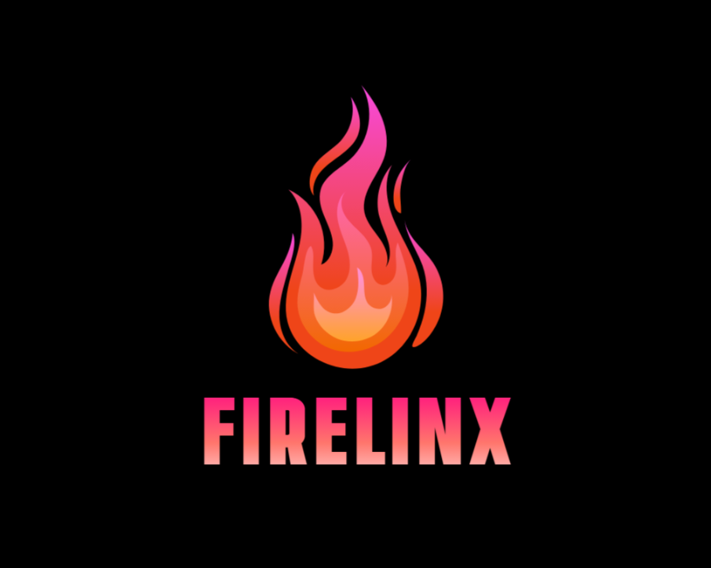

<p align="center">
  
</p>

<h1 align="center">FIRELINX</h1>

<p align="center">
  Advanced fire detection and emergency response system for a safer tomorrow...
</p>

<p align="center">
  
  
  
  
</p>


---

## 📸 Demo

> Add a gif or screenshot showing the project in action.


Live Demo: [https://YOUR_USERNAME.github.io/YOUR_PROJECT_NAME](https://YOUR_USERNAME.github.io/YOUR_PROJECT_NAME)

---

## 📖 About

Briefly explain what your project is, what problem it solves, and who it's for.

---

## ✨ Features

- ✅ Feature 1
- ✅ Feature 2
- ✅ Feature 3

---

## 🔧 Tech Stack

| Layer       | Tools                      |
|-------------|----------------------------|
| Frontend    | HTML, CSS, JavaScript      |
| Backend     | Node.js, Express.js        |
| Database    | MongoDB / Firebase         |
| Other Tools | Git, Postman, VS Code      |

---
## 🔒 License

This project is under a **custom restricted-use license**.

- You may view and modify the code **only** for suggesting improvements via Pull Requests.
- Publishing, selling, or redistributing this code **is not allowed**.
- All changes must be approved by project maintainers.

[See FIRELINX_LICENSE.txt for full terms.](./FIRELINX_LICENSE.txt)

---
## 🛠 Installation

Clone the repository:

```bash
git clone https://github.com/YOUR_USERNAME/YOUR_PROJECT_NAME.git
cd YOUR_PROJECT_NAME


